<p align="center">
  
</p>

<h1 align="center">⚡ LazyVerilog</h1>

<p align="center">
  <b>RTL 코딩을 위한 빠르고 실용적인 SystemVerilog LSP.</b>
</p>

<p align="center">
  <a href="https://github.com/lazyverilog/LazyVerilog/actions/workflows/ci.yml"></a>
  <a href="https://github.com/lazyverilog/LazyVerilog/actions/workflows/release.yml"></a>
</p>

<p align="center">
  <a href="https://github.com/lazyverilog/LazyVerilog/stargazers">
    
  </a>
  <a href="https://github.com/lazyverilog/LazyVerilog/releases/latest">
    
  </a>
  <a href="https://github.com/lazyverilog/LazyVerilog/issues">
    
  </a>
  <a href="https://github.com/sponsors/kjoonha">
    
  </a>
  <a href="https://github.com/MikePopoloski/slang">
    
  </a>
</p>

<p align="center">
  <a href="README.md">English</a>
  ·
  <b>한국어</b>
  ·
  <a href="README.zh-CN.md">简体中文</a>
</p>

<p align="center">
  <a href="#demo">데모</a>
  ·
  <a href="#why">왜 LazyVerilog인가</a>
  ·
  <a href="#features">기능</a>
  ·
  <a href="#installation">설치</a>
  ·
  <a href="#usage">사용법</a>
  ·
  <a href="#cli-tools">CLI 도구</a>
  ·
  <a href="#configuration">설정</a>
  ·
  <a href="#build">빌드</a>
</p>


<p align="center">
  LazyVerilog는 C++로 작성된 SystemVerilog LSP이며 neovim과 vscode를 지원합니다.
  실제 SystemVerilog 프로젝트를 위한 포매팅, 린트, 코드 탐색, 호버, 자동 완성, 인레이 힌트, RTL 코드 액션을 제공합니다.
</p>

&nbsp;

<a id="demo"></a>

## 🎬 데모

<details>
<summary><b>🎨 포매팅</b></summary>

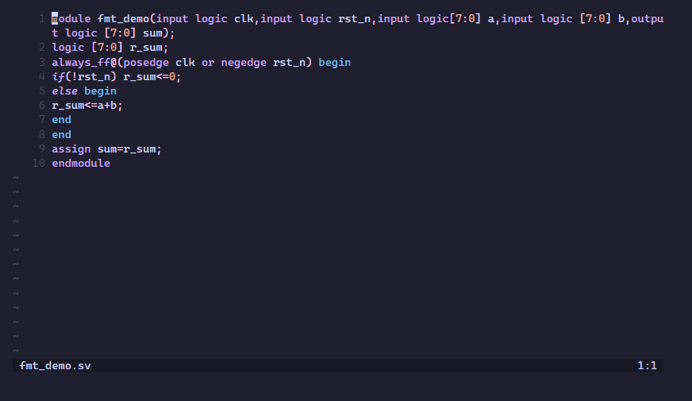

</details>

<details>
<summary><b>🚨 린트 진단</b></summary>

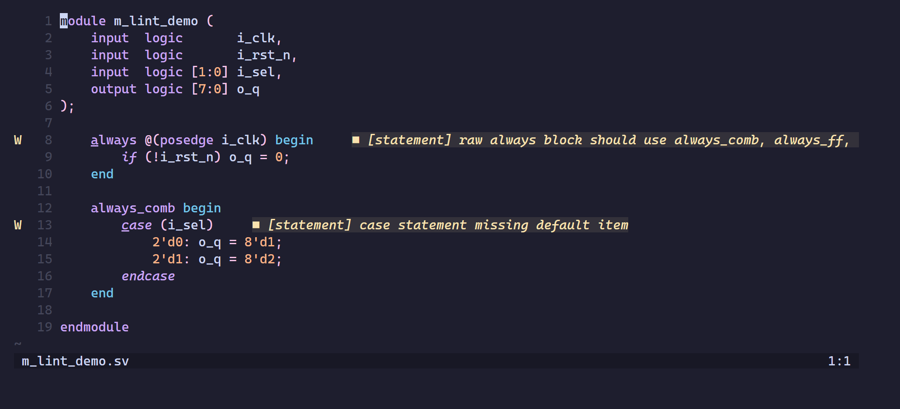

</details>

<details>
<summary><b>⚡ 자동 완성</b></summary>

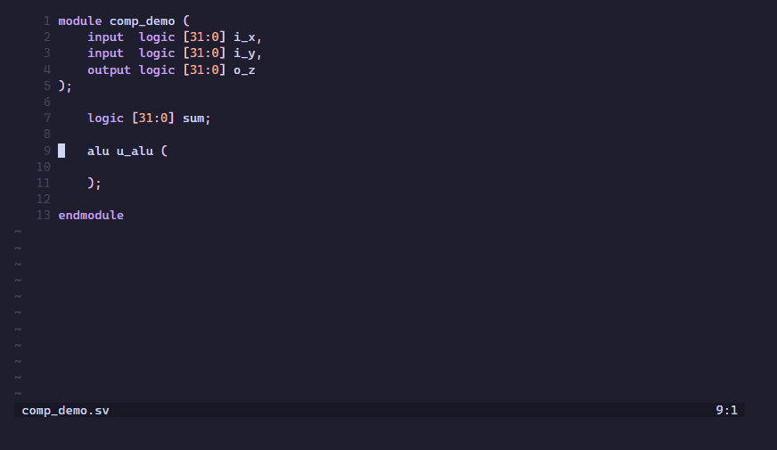

</details>

<details>
<summary><b>🌳 RTL 트리</b></summary>


</details>

<details>
<summary><b>📂 폴딩</b></summary>

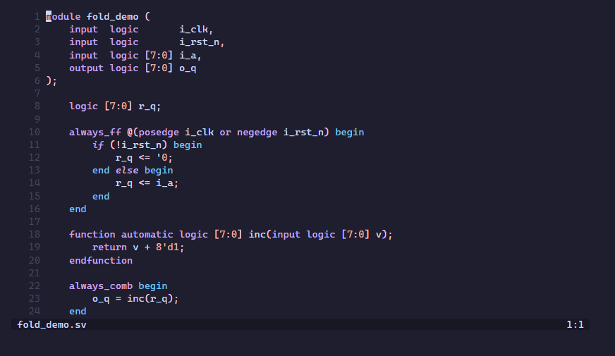

</details>

<details>
<summary><b>🧭 정의로 이동</b></summary>

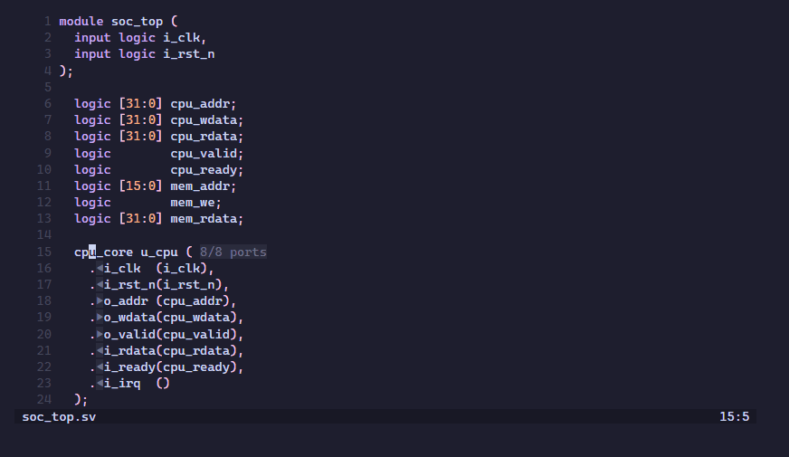

</details>

<details>
<summary><b>🔗 인터페이스 연결</b></summary>


</details>

<details>
<summary><b>🧩 자동 인스턴스화</b></summary>

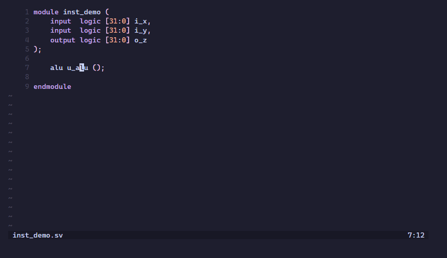

</details>

<details>
<summary><b>🔌 자동 와이어</b></summary>

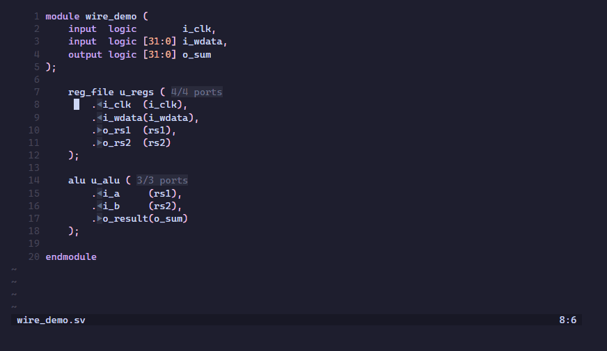

</details>

<details>
<summary><b>🛠️ 자동 포트 인자</b></summary>

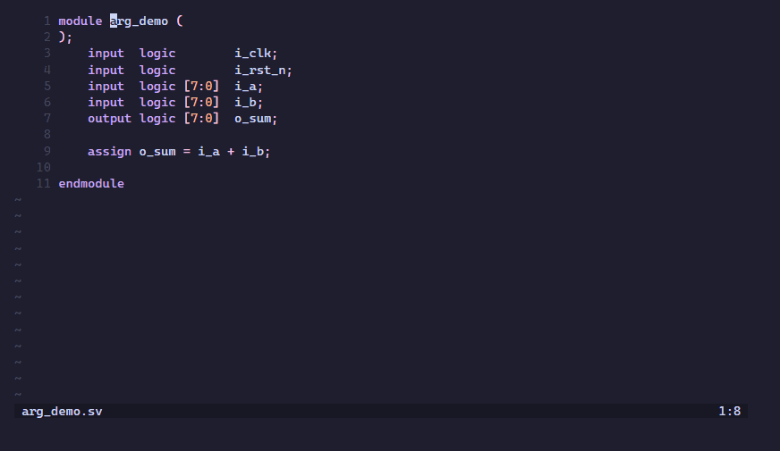

</details>

<details>
<summary><b>💡 호버</b></summary>

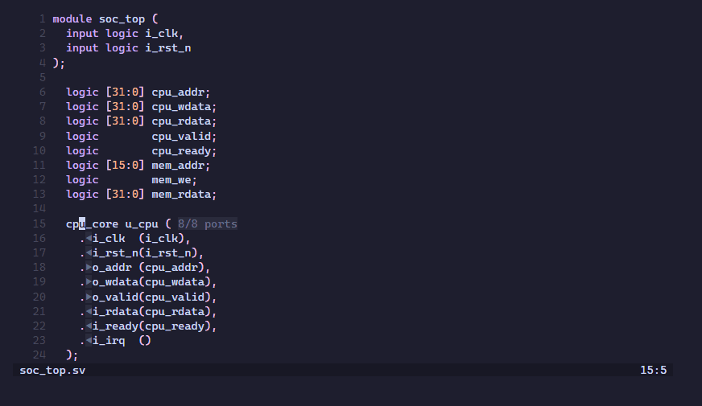

</details>

<details>
<summary><b>💬 인레이 힌트</b></summary>

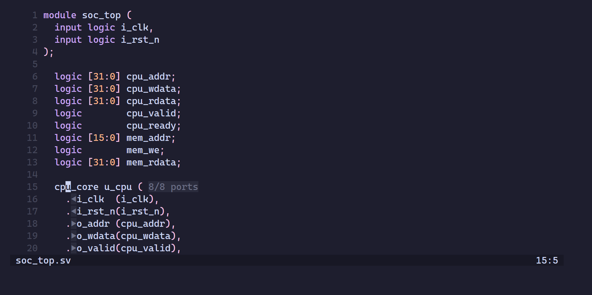

</details>

<details>
<summary><b>🔍 참조 찾기</b></summary>


</details>

<details>
<summary><b>✏️ 이름 바꾸기</b></summary>


</details>

<details>
<summary><b>🔭 워크스페이스 심볼</b></summary>

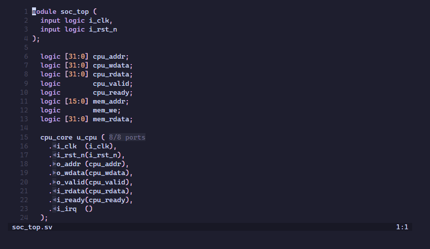

</details>

<details>
<summary><b>📝 시그니처 도움말</b></summary>

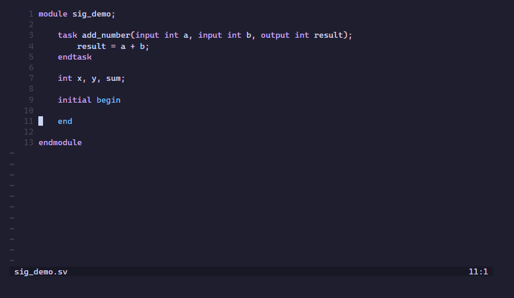

</details>

&nbsp;

<a id="why"></a>

## ✨ 왜 LazyVerilog인가?

<table>
  <tr>
    <td>🎯</td>
    <td><b>정확한 파싱</b></td>
    <td>SystemVerilog 문법을 <a href="https://github.com/MikePopoloski/slang">slang</a>으로 파싱합니다.</td>
  </tr>
  <tr>
    <td>🧠</td>
    <td><b>풍부한 LSP 기능</b></td>
    <td>인레이 힌트, 참조 찾기, 정의로 이동, 호버, 이름 바꾸기, 자동 완성, 시그니처 도움말, 린트 진단.</td>
  </tr>
  <tr>
    <td>⚙️</td>
    <td><b>RTL 자동화</b></td>
    <td>자동 포트 인자(Auto-arg), 자동 함수(Auto-function), 자동 와이어(Auto-wire), 자동 FF(Auto-FF), 자동 인스턴스화(Auto-instantiation).</td>
  </tr>
  <tr>
    <td>🧰</td>
    <td><b>커스터마이즈 가능</b></td>
    <td><code>lazyverilog.toml</code>로 프로젝트별 동작을 지정할 수 있습니다.</td>
  </tr>
</table>

&nbsp;

<a id="features"></a>

## 📊 기능

LazyVerilog가 현재 지원하는 기능입니다:

| 기능 | 상태 | 비고 |
|---------|--------|-------|
| 포매팅 | ✅ | `lazyverilog.toml`로 설정 가능 |
| 린트 진단 | ✅ | 파싱 진단, 선택적 시맨틱 진단, 설정 가능한 린트/스타일 규칙 |
| 정의로 이동 | ✅ | 모듈, 인스턴스, 포트, 이름 있는 인자, 심볼, 매크로 |
| 참조 찾기 | ✅ | 열린 파일과 설정된 프로젝트 파일 전반의 심볼과 매크로 |
| 심볼 이름 바꾸기 | ✅ | 프로젝트 파일 전반에 대해 최선 노력 방식으로 동작 |
| 호버 | ✅ | 모듈, 포트, 신호, 파라미터, typedef, 서브루틴, 매크로의 상세 정보 |
| 자동 완성 | ✅ | 문맥을 인식하는 자동 완성 |
| 시그니처 도움말 | ✅ | 함수와 태스크 |
| 인레이 힌트 | ✅ | 인스턴스화 시 포트 방향 표시 |
| 워크스페이스 심볼 | ✅ | 인덱싱된 디자인 파일의 모듈과 클래스 |
| RTL 트리 | ✅ | 모듈 인스턴스화 계층 구조 |
| 자동 인스턴스화 / 자동 와이어 / 자동 포트 인자 / 자동 함수 / 자동 FF | ✅ | RTL 생성을 위한 다양한 코드 액션 |
| 프로젝트별 설정 | ✅ | 프로젝트 루트의 `lazyverilog.toml`로 전체 커스터마이즈 가능 |

&nbsp;

<a id="installation"></a>

## 📦 설치

<a id="neovim-installation"></a>
<details>
<summary><b>Neovim 설치</b></summary>

💤 <a href="https://github.com/folke/lazy.nvim"><code>lazy.nvim</code></a> 사용 시:

```lua
{
  "lazyverilog/LazyVerilog",
  submodules = false,
  ft = { "systemverilog", "verilog" },
  config = function()
    require("lazyverilog").setup()
  end,
}
```

예시:

```lua
-- 자동 설치 / PATH / 관리형 바이너리 순서로 서버를 찾습니다.
require("lazyverilog").setup()

-- 로컬 빌드를 명시적으로 사용합니다.
require("lazyverilog").setup({
  cmd = "/path/to/lazyverilog-lsp",
})
```

</details>

<a id="vscode-installation"></a>
<details>
<summary><b>VS Code 설치</b></summary>

#### 1. 마켓플레이스 (권장)

[Visual Studio Marketplace](https://marketplace.visualstudio.com/items?itemName=lazyverilog.lazyverilog-vscode)에서 LazyVerilog를 설치하세요.

그 다음 `.sv`, `.svh`, `.v`, `.vh` 파일을 여세요. 확장은 Verilog/SystemVerilog 버퍼에서 LazyVerilog를 자동으로 시작하며,
필요한 경우 해당하는 `lazyverilog-lsp` 릴리스 바이너리를 설치합니다.

이미 로컬에서 빌드한 서버 바이너리가 있다면 VS Code 설정에서 직접 지정하세요:

```json
{
  "lazyverilog.serverPath": "/path/to/lazyverilog-lsp"
}
```

#### 2. GitHub 릴리스에서 수동 설치

마켓플레이스 버전을 아직 사용할 수 없다면 최신 [GitHub Release](https://github.com/lazyverilog/LazyVerilog/releases/latest)에서 VSIX를 내려받으세요.

그 다음 VS Code에서 설치합니다:

1. `Ctrl+Shift+P`를 눌러 명령 팔레트를 엽니다.
2. `Extensions: Install from VSIX...`를 실행합니다.
3. 내려받은 `lazyverilog-<version>.vsix` 파일을 선택합니다.

</details>

<a id="usage"></a>

## 🚀 사용법

### 1. RTL 프로젝트 루트에 프로젝트 설정을 추가합니다.

프로젝트 루트에 `lazyverilog.toml`을 만드세요. 최소한 `design.vcode`가 파일리스트를 가리키도록 해야
LazyVerilog가 모듈, 패키지, 포트, 파일 간 참조를 인덱싱할 수 있습니다.

전체 설정은 [`lazyverilog.toml`](lazyverilog.toml)을 참고하세요 — 완전한 예시 설정입니다.

```toml
[design]
vcode = "path/to/vcode/file"
define = ["VERILATOR", "MY_DEFINE"]

[compilation]
background_compilation = true   # 백그라운드 워커에서 시맨틱 컴파일을 수행합니다(더 풍부한 진단).
                                # 주의: 느린 장비에서는 반응이 느려질 수 있습니다.

[format]
enable_format_on_save = true # 파일 저장 시 자동 포매팅.
indent_size = 4

[lint]
enable = true # 린트 진단 표시

[lint.naming]
enable = true
severity = "warning"
input_port_pattern = "^i_.*$"  # 정규식; 입력 포트는 i_로 시작해야 합니다
output_port_pattern = "^o_.*$" # 정규식; 출력 포트는 o_로 시작해야 합니다

[inlay_hint]
enable = true
```

`vcode.f` 예시:

```text
path/to/rtl1.sv
path/to/rtl2.sv
path/to/rtl3.sv
+incdir+path/to/your/include_dir1
+incdir+path/to/your/include_dir2
```

<details>
<summary><b>neovim 사용자 가이드</b></summary>

#### SystemVerilog 프로젝트 열기

Verilog/SystemVerilog RTL 파일을 엽니다:

서버는 루트(`/`) 방향으로 거슬러 올라가며 `lazyverilog.toml`을 찾습니다.

```bash
nvim path/to/rtl.sv
```

Neovim 플러그인은 첫 실행 시 LazyVerilog 릴리스를 내려받습니다. 그 후 `verilog`와 `systemverilog` 버퍼에서 LazyVerilog LSP를 자동으로 시작합니다.
`:LspInfo`로 `lazyverilog` 클라이언트가 연결되었는지 확인하세요.

#### 표준 LSP 액션 사용

LazyVerilog는 일반적인 Neovim LSP 기능을 제공합니다. 기존 LSP 키맵을 그대로 쓰거나 아래처럼
매핑을 추가하세요:

```lua
vim.keymap.set("n", "gd", vim.lsp.buf.definition)
vim.keymap.set("n", "gr", vim.lsp.buf.references)
vim.keymap.set("n", "K", vim.lsp.buf.hover)
vim.keymap.set("n", "<leader>rn", vim.lsp.buf.rename)
vim.keymap.set({ "n", "v" }, "<leader>ca", vim.lsp.buf.code_action)
```

커서가 지원되는 구문 위에 있을 때 AutoInst, AutoWire, AutoArg, AutoFunc, AutoFF 같은 RTL 헬퍼가
코드 액션으로 제공됩니다.

#### LazyVerilog 명령 사용

| 명령 | 설명 |
|---------|-------------|
| `:Format` | 현재 버퍼 또는 비주얼 범위를 포매팅 |
| `:Lint` | 현재 버퍼의 진단 표시 |
| `:LintAll` | 인덱싱된 프로젝트 파일의 진단 표시 |
| `:RtlTree` | 모듈 인스턴스화 계층 구조 열기 |
| `:RtlTreeReverse` | 현재 모듈 기준 역방향 계층 구조 열기 |
| `:Interface <inst>` | 인스턴스 하나의 인터페이스 확인 |
| `:Interface <inst1> <inst2>` | 두 인스턴스 사이의 연결 확인 및 편집 |
| `:Connect <module1> <module2>` | 계층 구조를 따라 모듈 인스턴스를 대화식으로 연결 |

</details>

<details>
<summary><b>vscode 사용자 가이드</b></summary>

확장을 설치한 뒤 VS Code에서 Verilog/SystemVerilog RTL 파일을 여세요. 확장은 `verilog`와
`systemverilog` 버퍼에서 LazyVerilog를 자동으로 시작합니다.

명령 팔레트에서 다음과 같은 LazyVerilog 명령을 사용할 수 있습니다:

- `LazyVerilog: Format Document`
- `LazyVerilog: Lint Current File`
- `LazyVerilog: Lint All Files`
- `LazyVerilog: Show RTL Hierarchy`
- `LazyVerilog: Show RTL Hierarchy (Reverse)`

설치와 `lazyverilog.serverPath` 설정은 위의 [VS Code 설치 안내](#vscode-installation)를 참고하세요.

</details>

<a id="cli-tools"></a>

## 🧰 CLI 도구

LazyVerilog는 에디터용 `lazyverilog-lsp` 서버와 함께 스크립트/CI에서 쓸 수 있는 독립 실행형
커맨드라인 바이너리도 제공합니다. 각 바이너리는 LSP 서버와 동일하게 대상 파일의 디렉터리에서
위로 올라가며 `lazyverilog.toml`을 읽습니다.

<details>
<summary><b><code>lazyverilog-fmt</code> — 독립 실행형 포매터</b></summary>

파일 하나를 stdout으로 포매팅하거나, `-i`로 파일을 직접 수정합니다.

```bash
cmake --build build -j$(nproc) --target lazyverilog-fmt
./build/lazyverilog-fmt -i rtl/memory_top.sv
```

| 플래그 | 설명 |
|------|-------------|
| `-i`, `--in-place` | 포매팅 결과를 stdout 대신 원본 파일에 씁니다 |
| `--log <log-dir>` | 디버깅을 위해 포매터 내부 패스 로그를 `<log-dir>`에 기록합니다 |

전체 레퍼런스: [`docs/formatter/cli.md`](docs/formatter/cli.md).

</details>

<details>
<summary><b><code>lazyverilog-lint</code> — 독립 실행형 린터</b></summary>

파일 하나 또는 `-f` 파일리스트의 모든 파일을 린트하고, 린트 진단과 컴파일 진단을
`<file>:<line>:<col>: <severity>: <message>` 형식으로 보기 좋게 출력합니다.

```bash
cmake --build build -j$(nproc) --target lazyverilog-lint
./build/lazyverilog-lint rtl/memory_top.sv
./build/lazyverilog-lint -f rtl/vcode.f
```

| 플래그 | 설명 |
|------|-------------|
| `-f <filelist>` | `<file>` 대신(또는 함께) 프로젝트 파일리스트의 모든 파일을 린트합니다 |
| `--lint-only` | 린트 규칙 진단만 출력하고 파싱/시맨틱 진단은 제외합니다 |

전체 레퍼런스: [`docs/linter/cli.md`](docs/linter/cli.md).

</details>

<details>
<summary><b><code>lazyverilog-rtltree</code> — 독립 실행형 RTL 계층 구조 뷰어</b></summary>

`<file>`의 모듈을 루트로 하는 모듈 인스턴스화 계층 구조를 들여쓰기된 트리로 출력합니다 —
기본은 정방향(자식), `--reverse`를 주면 역방향(부모)입니다.

```bash
cmake --build build -j$(nproc) --target lazyverilog-rtltree
./build/lazyverilog-rtltree rtl/memory_top.sv
./build/lazyverilog-rtltree --reverse rtl/memory.sv
```

| 플래그 | 설명 |
|------|-------------|
| `-f <filelist>` | 파일 간 계층 구조 해석을 위한 프로젝트 파일리스트 |
| `--reverse` | 정방향 대신 역방향 계층 구조를 만듭니다 |

전체 레퍼런스: [`docs/rtl-tree/cli.md`](docs/rtl-tree/cli.md).

</details>

<a id="build"></a>

## 🏗️ 빌드

### ✅ 요구 사항

- CMake
- C++20을 지원하는 컴파일러

### 🧱 빌드 방법

```bash
cmake -B build -DCMAKE_BUILD_TYPE=Release
cmake --build build -j$(nproc) --target lazyverilog-lsp
```

### 서버 바이너리 탐색 순서

에디터는 다음 순서로 `lazyverilog-lsp` 서버를 찾습니다:

1. 명시적 설정 경로
   - VS Code: `lazyverilog.serverPath`를 설정합니다.
   - Neovim: `require("lazyverilog").setup({ ... })`에 `cmd`를 전달합니다.
   - LazyVerilog가 절대 교체하면 안 되는 로컬 빌드나 커스텀 바이너리에는 이 방법을 사용하세요.
2. PATH 바이너리
   - `lazyverilog-lsp`가 `PATH`에 있으면(Windows에서는 `lazyverilog-lsp.exe`) 에디터가 사용자 소유 바이너리로 사용합니다.
   - PATH 바이너리는 LazyVerilog가 체크섬을 검사하거나 자동으로 업데이트하지 않습니다.
3. 관리형 바이너리
   - 명시적 설정 경로도 PATH 바이너리도 없으면, 에디터는 자체 관리 저장 디렉터리를 사용하며 해당 릴리스 바이너리를 그곳에 내려받을 수 있습니다.
   - 관리형 바이너리는 릴리스 소유입니다. 플러그인이나 VS Code 확장이 업데이트되면 오래된 관리형 바이너리는 현재 검증된 릴리스 바이너리로 교체될 수 있습니다.
   - 커스텀 빌드를 관리형 바이너리 디렉터리에 두지 마세요. 명시적 설정 경로나 PATH를 사용하세요.

<a id="configuration"></a>

## ⚙️ 설정

LazyVerilog는 프로젝트 루트의 `lazyverilog.toml`을 읽습니다. neovim을 하위 디렉터리에서 열었다면, LazyVerilog가 가장 가까운 설정 파일을 찾을 때까지 위로 거슬러 올라갑니다.

이 설정은 디자인 입력, 시맨틱 컴파일, 린트 규칙, 포매터 정책, RTL 트리 표시, 인레이 힌트, 자동화 헬퍼를 제어합니다.

<details open>
<summary>📝 최소 예시</summary>

```toml
[design]
vcode = "demo/vcode.f"
define = ["RTL_SIM"]

[format]
enable_format_on_save = true
indent_size = 4

[lint]
enable = true
```

</details>

## 📚 문서

- [`lazyverilog.toml`](lazyverilog.toml) — 완전한 예시 설정.
- [`docs/features.md`](docs/features.md) — 전체 기능 한눈에 보기.
- [`docs/releases/v1.1.0.md`](docs/releases/v1.1.0.md) — 최신 릴리스 노트.

**프로젝트**
- [`docs/design/index.md`](docs/design/index.md) — 디자인 파일리스트와 전처리기 define.

**LSP & 에디터**
- [`docs/lsp/index.md`](docs/lsp/index.md) — 호버, 정의로 이동, 참조 찾기, 이름 바꾸기, 자동 완성, 시그니처 도움말, 인레이 힌트, 워크스페이스 심볼.

**포매터**
- [`docs/formatter/cli.md`](docs/formatter/cli.md) — CLI 사용법과 빌드 방법.
- [`docs/formatter/options.md`](docs/formatter/options.md) — 포매터 옵션.
- [`docs/formatter/macros.md`](docs/formatter/macros.md) — 매크로 포매팅 정책.

**린터**
- [`docs/linter/cli.md`](docs/linter/cli.md) — `lazyverilog-lint` CLI 사용법과 빌드 방법.
- [`docs/linter/options.md`](docs/linter/options.md) — RTL 예시와 함께 보는 린터 옵션.

**시맨틱 진단**
- [`docs/diagnostics/background-compilation.md`](docs/diagnostics/background-compilation.md) — 백그라운드 시맨틱 진단.

**자동화 기능**
- [`docs/autoarg/index.md`](docs/autoarg/index.md) — 비-ANSI 모듈 포트 목록 생성.
- [`docs/autoinst/index.md`](docs/autoinst/index.md) — 모듈 인스턴스화 포트 연결 생성.
- [`docs/autowire/index.md`](docs/autowire/index.md) — 누락된 신호 선언 생성.
- [`docs/autofunc/index.md`](docs/autofunc/index.md) — 함수/태스크 호출 인자 생성.
- [`docs/autoff/index.md`](docs/autoff/index.md) — 기존 always_ff 블록에 리셋/캡처 대입 삽입.
- [`docs/connect.md`](docs/connect.md) — 모듈 인스턴스의 출력-입력 포트를 대화식으로 연결.
- [`docs/interface.md`](docs/interface.md) — 인스턴스 사이의 신호 인터페이스 확인 및 편집.
- [`docs/rtl-tree/index.md`](docs/rtl-tree/index.md) — 모듈 인스턴스화 계층 구조 뷰어.
- [`docs/rtl-tree/cli.md`](docs/rtl-tree/cli.md) — `lazyverilog-rtltree` CLI 사용법과 빌드 방법.

**개발자용**
- [`docs/dev/test.md`](docs/dev/test.md) — 빌드, 테스트, RTL 포맷 스윕.
- [`docs/dev/files.md`](docs/dev/files.md) — 디자인 파일리스트 캐시와 추가 파일 mtime 동작.
- [`TODO.md`](TODO.md) — 계획된 기능과 알려진 이슈.

&nbsp;

## 🤝 기여하기

기여를 환영합니다.

풀 리퀘스트를 보내기 전에:

1. 프로젝트를 빌드하세요.
2. 관련 테스트를 실행하세요.
3. 포매터, 린트, LSP, 자동화 변경에는 테스트를 추가하거나 갱신하세요.
4. 사용자에게 보이는 동작이나 설정이 바뀌면 문서를 갱신하세요.

권장 검증:

```bash
cmake -B build
cmake --build build -j$(nproc)
ctest --test-dir build
```

> [!IMPORTANT]
> 포매터 변경에는 `tests/test_formatter.cpp`에 집중된 테스트 케이스를 포함하고, 멱등성과 세이프 모드 보장을 유지해야 합니다.

&nbsp;

## 📜 라이선스

LazyVerilog는 MIT 라이선스로 배포됩니다. [`LICENSE`](LICENSE)를 참고하세요.
